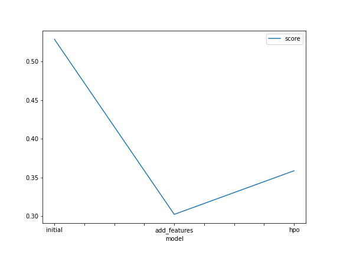
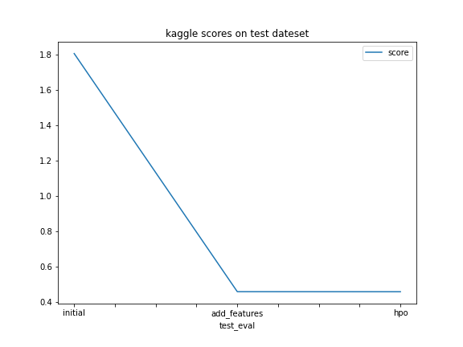

# Report: Predict Bike Sharing Demand with AutoGluon Solution
#### AMIR HELMY SHAWKY

## Initial Training
### What did you realize when you tried to submit your predictions? What changes were needed to the output of the predictor to submit your results?
At first when i tried to submit to findings to the competition kaggle refused my submission as it does not accept negative values in target column "count", so i replaced this negative values with "0", because when you have negative number of people comming this means no one is comming.

### What was the top ranked model that performed?
My top ranked model that performed is the one with more hyperparameters.

## Exploratory data analysis and feature creation
### What did the exploratory analysis find and how did you add additional features?
##### My findings with  intial EDA
- We can extract time of the day hour and month from datetime column. 
- There are some features that needs to be with a categoey type such as "season" and "weather" .
- The four seasons have are perfetly balanced with each others, there is no season more that the other.
- Our target column "count" is right-skewed, it ranges from 0 to almost 1000, but the values are centered under 250.

### How much better did your model preform after adding additional features and why do you think that is?
The second model performed way better than the first one, because we changed the type of these column "weather" and "season" to category
to make the model not to treat them like they are just numbers.
Also we added some features to help the model identify the time of the day and which monthwe are in.

## Hyper parameter tuning
### How much better did your model preform after trying different hyper parameters?
This part specificly could need more time in trying more params and its expensive;
But i did some hyperparameters tunning and it made the model slightly better.
### If you were given more time with this dataset, where do you think you would spend more time?
As i said if i have more time and resourses it will be benificial to spend on hyperparams tunning.

### Create a table with the models you ran, the hyperparameters modified, and the kaggle score.
|model|hpo1|hpo2|hpo3|score|
|initial|label|label|eval_metric|1.80657|
|add_features|time_limit|time_limit|problem_typ|0.45996|
|hpo|presets|presets|presets|0.45967|

### Create a line plot showing the top model score for the three (or more) training runs during the project.

### Create a line plot showing the top kaggle score for the three (or more) prediction submissions during the project.

## Summary
The data was clean and ready to use, also wwe did not have the domain knowledge to understand some specifics such as,
why data are splitted in train and test with a way that the train have the first 20 days of each month, and the the test have the rest days.

But we moved forward anyway on pridicting the target "Count" column, also we made a pretty god job in that, but if we have more time and resourses we could make some more hyperparametrs tunning to make our model more accurate, also we could make further modifications and try separate models on their own like XGboost or linear regression, etc but this project requires me to use auto ML .

